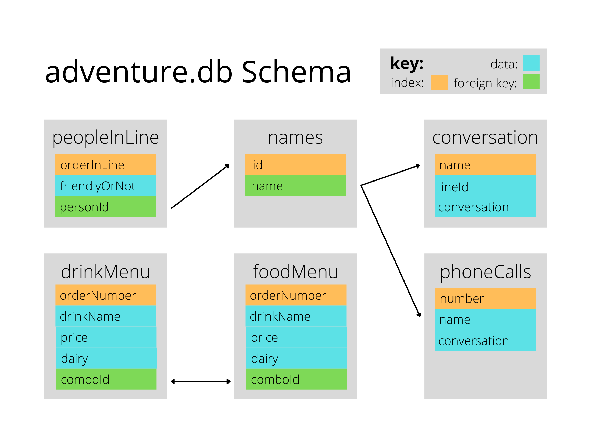

You've just woken up and are getting ready to start your day as a Data Analyst. What better way to start the day than heading to your local coffee shop to grab a cup of joe? 

This choose your own adventure is designed as a fun way to practice your SQL skills.

# What you need to play:
* **adventure.db:** This SQLite database file has all of the data you'll need for the story
* **The Story Outline:** Further down in this readme, Read through this while doing your queries! (this is the story part :) )
* **Hints:** For if you get stuck with queries throughout the story
* **[A SQL Reference](https://github.com/NUKnightLab/sql-mysteries/blob/master/reference.pdf)**: This is a crash course on SQL concepts and commands written by @Joonpark13 .
* **A SQLite environment**: For the purposes of the story-outline, we'll run SQLite3 directly in terminal.

# Schema

# Story

## Chapter 1

*beep beep* *beep beep* That's your alarm clock waking you up for another Monday in Morgantown, West Virginia. You roll out of bed, drink some water, and get ready for the day. But, there's something missing ... a coffee from the Dunkin' Donuts down the street.

You walk out the door with a smile on your face and a stride in your step. After traveling all the way down the street to the coffeeshop, you open the door. *the ambiance of coffeeshop chatter fills the air*

To your dismay, there's a line of 8 people before you waiting to order with the barista. They look like a mix of characters (literally).

To see the friendly levels of the people in line:

In a terminal, navigate to a folder / repository of your choice that contains the **adventure.db**, and type **SQLite3 adventure.db** to be able to access the database.

Then type, **.mode column** and **.nullvalue NULL** and **.header on** and you're ready to go.

Now, **query and display the entire peopleInLine table**. *hint #1*

Wow! Those look like some interesting people, but you don't know any of their names, only their place in line and person-id.

To ask for someone's name in line, **join the "peopleInLine" table with the "names" table and query the name of the person you want to talk to where their order in line is equal to who you want to talk to** *hint #2*. Or, if you don't want to talk to anyone, query using the 0th place in line.

Once you have their name, strike up a conversation!

**Query the conversation from conversation with their name, and with a lineId less than 2** *hint #3*

## Bonus

If you recieved a phone number throughout your adventure, call them now!

**Query phone for where phoneNumber is equal to their number** *hint *

# People
**Author:**
[John Driscoll](https://www.linkedin.com/in/john-driscoll-/)

**Inspiration:**
https://github.com/NUKnightLab/sql-mysteries
